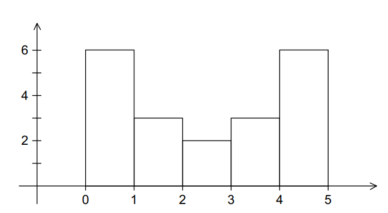
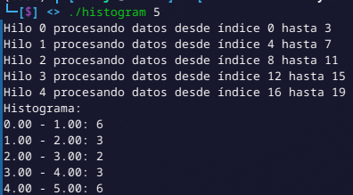
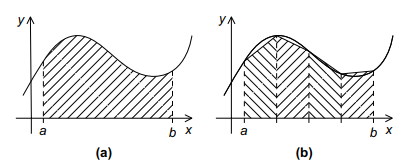
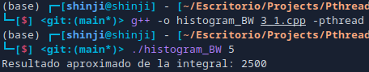
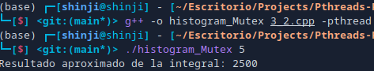
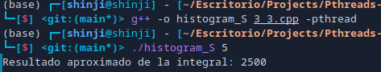
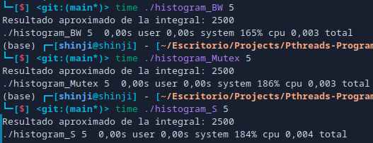
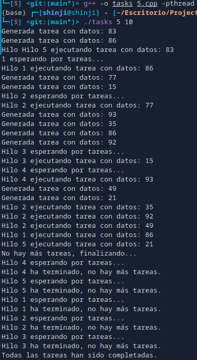

# Pthreads Programming Assignments

Based on Peter Pacheco-An Introduction to Parallel Programming-Morgan Kaufmann (2011)

By Braulio Nayap Maldonado Casilla

## Ejercicio 4.1

### Contexto

Según la sección 2.7.1 mencionada:

1. **Generación de Datos**: Se tiene un conjunto de datos que son números de punto flotante. En el ejemplo dado, los datos son:

   ```
   1.3, 2.9, 0.4, 0.3, 1.3, 4.4, 1.7, 0.4, 3.2, 0.3,
   4.9, 2.4, 3.1, 4.4, 3.9, 0.4, 4.2, 4.5, 4.9, 0.9
   ```

2. **Rango de Datos**: Los datos se encuentran en un rango de 0 a 5. Esto significa que se desea visualizar la distribución de estos datos en este rango específico.

3. **División en Bins**: Para crear un histograma, el rango de los datos se divide en intervalos iguales, llamados "bins". En el ejemplo, se elige dividir el rango en 5 bins.

4. **Conteo de Mediciones**: Para cada bin, se cuenta cuántos datos caen dentro de ese intervalo. Esto permite observar la distribución de los datos a través de los diferentes bins.

5. **Representación del Histograma**: Finalmente, el histograma se puede representar como un gráfico de barras donde cada barra indica el número de mediciones en cada bin.



### Implementación con Pthreads

- **Importaciones de Bibliotecas:** Se incluyen bibliotecas necesarias para entrada/salida, vectores, manipulación de salida, hilos y funciones de utilidad.

- **Definición de la Estructura `ThreadArgs`:** Se define una estructura para almacenar los argumentos necesarios para cada hilo, incluyendo identificador, datos, número de bins, valores de rango, y un puntero al histograma local.

  ```cpp
  struct ThreadArgs
  {
      int thread_id;
      const std::vector<double> *data;
      int num_bins;
      double min_value;
      double bin_width;
      int start;
      int end;
      std::vector<int> *local_histogram;
  };
  ```

- **Definición de la Función `calculateHistogram`:** Se define la función que ejecutarán los hilos. Los argumentos se convierten a `ThreadArgs` para su uso.

- **Extracción de Parámetros:** Se extraen los parámetros necesarios desde la estructura.

- **Cálculo del Histograma Local:** Se itera sobre los datos asignados al hilo y se calcula el índice del bin correspondiente para incrementar el histograma local.

  ```cpp
  for (int i = start; i < end; ++i)
  {
      double value = data[i];
      if (value >= min_value && value < (num_bins * bin_width) + min_value)
      {
          int bin_index = static_cast<int>((value - min_value) / bin_width);
          local_histogram[bin_index]++;
      }
  }
  ```

- **Finalización de la Función:** La función finaliza devolviendo `nullptr`.

- **Inicio de `main` y Comprobación de Argumentos:** Se inicia el programa y se verifica que se reciba el número de hilos como argumento.

- **Configuración de Parámetros del Histograma:** Se definen el número de bins y se calculan los valores mínimos, máximos y el ancho de cada bin.

- **Inicialización de Datos:** Se inicializa un vector con los datos a procesar.

- **Cálculo de Tamaño de Datos y Localización:** Se calcula el tamaño total de los datos y el tamaño local que cada hilo procesará.

- **Inicialización del Histograma Global:** Se crea un vector para almacenar el histograma global, inicializado en cero.

- **Creación y Lanzamiento de Hilos:** Se crean y lanzan hilos, configurando sus argumentos antes de llamarlos.
  ```cpp
  for (int t = 0; t < num_threads; ++t)
  {
      thread_args[t] = {t, &data, num_bins, min_value, bin_width, t * local_size,
                        (t == num_threads - 1) ? data_size : (t + 1) * local_size,
                        &local_histograms[t]};
      pthread_create(&threads[t], nullptr, calculateHistogram, &thread_args[t]);
  }
  ```
- **Sincronización de Hilos:** Se espera a que todos los hilos terminen antes de continuar.
  ```cpp
  for (int t = 0; t < num_threads; ++t)
        pthread_join(threads[t], nullptr);
  ```
- **Combinar Histogramas Locales:** Se suman los histogramas locales a un histograma global.

  ```cpp
  for (int t = 0; t < num_threads; ++t)
        for (int b = 0; b < num_bins; ++b)
            global_histogram[b] += local_histograms[t][b];
  ```

- **Impresión del Histograma Global:** Se imprime el histograma global con el rango y conteo de cada bin.

### Ejecución

```bash
g++ -o histogram 1.cpp -pthread
./histogram <num_threads>
```

### Visualización



## Ejercicio 4.3

### Contexto

La regla trapezoidal es un método numérico utilizado para aproximar la integral definida de una función. Se basa en dividir el área bajo la curva en trapezoides y sumar sus áreas. Para implementar esto en un programa de Pthreads:

1. **Dividir el intervalo de integración** en subintervalos (por ejemplo, dividirlo en `n` subintervalos).
2. **Cada hilo calculará el área** de uno o más trapezoides en su intervalo asignado.
3. **Utilizar una variable compartida** para almacenar la suma total de las áreas calculadas por todos los hilos.



#### Enfoques para Exclusión Mutua

1. **Busy-Waiting (Espera Activa):**

   - **Descripción:** Un hilo que necesita acceder a la sección crítica se queda en un bucle comprobando repetidamente si puede entrar. No libera la CPU mientras espera.
   - **Implementación:**

     - Un hilo utiliza un bucle que comprueba si puede adquirir el control del recurso compartido.

   - **Ventajas:**

     - Simple de implementar y entender.
     - Puede ser adecuado para sistemas de tiempo real donde los tiempos de espera son cortos.

   - **Desventajas:**
     - Desperdicia CPU: consume recursos de CPU mientras espera, lo que puede llevar a una reducción del rendimiento en sistemas con múltiples hilos.
     - No es eficiente para tareas largas, ya que los hilos ocupan ciclos de CPU innecesariamente.

2. **Mutexes (Mutual Exclusion Locks):**

   - **Descripción:** Un mutex es una primitiva de sincronización que permite que un solo hilo acceda a un recurso compartido en un momento dado.
   - **Implementación:**

     - Antes de entrar en la sección crítica, un hilo bloquea el mutex. Después de completar la operación, libera el mutex.

   - **Ventajas:**

     - Eficiente: los hilos no desperdician CPU mientras esperan.
     - Proporciona una solución robusta para la sincronización de acceso a recursos compartidos.

   - **Desventajas:**
     - Puede haber un aumento en la complejidad del código, especialmente en la gestión de errores.
     - Pueden ocurrir condiciones de bloqueo si no se gestionan adecuadamente.

3. **Semaphores:**

   - **Descripción:** Un semáforo es un contador que se utiliza para controlar el acceso a un recurso compartido. Puede permitir que varios hilos accedan simultáneamente hasta un límite especificado.
   - **Implementación:**

     - Un hilo decrementa el semáforo antes de entrar en la sección crítica y lo incrementa al salir.

   - **Ventajas:**

     - Permiten mayor flexibilidad en el control de acceso a recursos compartidos.
     - Pueden permitir la sincronización entre hilos sin necesariamente usar exclusión mutua total.

   - **Desventajas:**
     - Más difícil de implementar correctamente que los mutexes.
     - Pueden ser propensos a problemas de condición de carrera si no se usan adecuadamente.
     - La lógica puede volverse más compleja, especialmente cuando se utilizan múltiples semáforos.

### Implementación con Pthreads

### Partes Comunes en los Códigos:

1. **Límites de integración y función objetivo**:

   - Los códigos tienen los mismos límites de integración (`a = 0.0`, `b = 10.0`) y el número de trapezoides (`n = 1000000`).
   - Utilizan la función `f(x) = x^3` como la función a integrar.

   ```cpp
   double a = 0.0, b = 10.0;
   int n = 1000000;
   double f(double x)
   {
    return x * x * x;
   }
   ```

2. **Estructura de datos para hilos**:

   - Todos utilizan la estructura `ThreadData` para almacenar datos relevantes por hilo: `thread_id`, `a`, `b`, `n` y `num_threads`.

   ```cpp
   struct ThreadData
   {
    int thread_id;
    double a, b;
    int n, num_threads;
   };
   ```

3. **Cálculo local de la integral**:  
   Cada hilo trabaja en un subrango determinado por:

   ```cpp
   double local_a = data->a + thread_id * (data->b - data->a) / data->num_threads;
   double local_b = local_a + (data->b - data->a) / data->num_threads;
   int local_n = data->n / data->num_threads;
   double h = (data->b - data->a) / data->n;
   ```

   Los valores `local_a`, `local_b` y `local_n` se usan para dividir la tarea.

4. **Acumulación parcial del resultado**:
   Dentro de cada subrango, se aplica la regla trapezoidal:

   ```cpp
   for (int i = 0; i < local_n; ++i) {
       double x1 = local_a + i * h;
       double x2 = local_a + (i + 1) * h;
       local_result += (f(x1) + f(x2)) * h / 2.0;
   }
   ```

5. **Suma al resultado global**:
   La suma acumulada se agrega a la variable compartida `global_result` en una sección crítica que varía según el método:

   ```cpp
   global_result += local_result;
   ```

6. **Creación y unión de hilos**:

   - El `main` crea un número de hilos según lo especificado por el usuario y luego los une (`pthread_create` y `pthread_join`).

   ```cpp
   for (int i = 0; i < num_threads; ++i)
    {
        thread_data[i] = {i, a, b, n, num_threads};
        pthread_create(&threads[i], nullptr, trapezoidalRule, &thread_data[i]);
    }

    for (int i = 0; i < num_threads; ++i)
        pthread_join(threads[i], nullptr);
   ```

#### Busy-Waiting

```cpp
bool busy_flag = false; // Bandera para sincronización

void *trapezoidalRule(void *args) {
    // Cálculo del rango local y resultado parcial...
    while (busy_flag)     // Espera activa
        ;
    busy_flag = true;     // Bloqueo de la sección crítica
    global_result += local_result; // Actualización compartida
    busy_flag = false;    // Liberación de la sección crítica
}
```

1. **Sincronización**: Usa una bandera `busy_flag` para garantizar acceso exclusivo.
2. **Acceso a la sección crítica**:

   - Los hilos verifican continuamente `busy_flag` en un **bucle activo** hasta que es `false`.
   - Cuando un hilo entra en la sección crítica, establece `busy_flag = true`.
   - Otros hilos deben esperar hasta que el hilo actual complete la operación y restablezca `busy_flag = false`.

3. **Eficiencia**:
   - **Ineficiente** en entornos multitarea, ya que los hilos consumen recursos mientras esperan.

#### Mutex

```cpp
#include <mutex>
std::mutex result_mutex; // Mutex para sincronización

void *trapezoidalRule(void *args) {
    // Cálculo del rango local y resultado parcial...
    result_mutex.lock();              // Bloqueo del mutex
    global_result += local_result;    // Actualización compartida
    result_mutex.unlock();            // Liberación del mutex
}
```

1. **Sincronización**: Utiliza un **mutex** para bloquear y desbloquear la sección crítica.
2. **Acceso a la sección crítica**:
   - `lock()` impide que otros hilos entren hasta que el actual complete su tarea.
   - Una vez terminado, `unlock()` permite que otros hilos entren en la sección crítica.
3. **Eficiencia**:

   - **Suspenden los hilos en espera** en lugar de hacerlos esperar activamente, mejorando la eficiencia en recursos.

4. **Seguridad**:
   - Protege contra condiciones de carrera.
   - Automatiza el acceso exclusivo sin intervención constante del programador.

#### Semaphores

```cpp
#include <semaphore.h>
sem_t result_semaphore;  // Declaración de semáforo

void *trapezoidalRule(void *args) {
    // Cálculo del rango local y resultado parcial...
    sem_wait(&result_semaphore);       // Decrementa el semáforo y bloquea
    global_result += local_result;     // Actualización compartida
    sem_post(&result_semaphore);       // Incrementa el semáforo y desbloquea
}

int main() {
    sem_init(&result_semaphore, 0, 1); // Inicializa con 1 (sección crítica única)
    // Lógica para crear y ejecutar hilos...
    sem_destroy(&result_semaphore);    // Limpieza final
}
```

1. **Sincronización**: Utiliza un **semáforo binario** inicializado en 1 para permitir un hilo en la sección crítica.
2. **Acceso a la sección crítica**:
   - `sem_wait()` decrementa el semáforo. Si el valor es 0, el hilo queda en espera.
   - `sem_post()` incrementa el semáforo, permitiendo que otro hilo acceda.
3. **Eficiencia**:

   - Similar a `mutex`, permite suspender hilos en espera.
   - Semáforos pueden manejar varios recursos simultáneamente configurando valores mayores a 1.

4. **Flexibilidad**:
   - Los semáforos son más generales que los mutex, ya que pueden permitir más de un hilo simultáneamente si se configuran de manera adecuada.

### Ejecución y Visualización

#### Busy-Waiting

```bash
g++ -o histogram_BW 3_1.cpp -pthread
./histogram_BW <num_threads>
```



#### Mutex

```bash
g++ -o histogram_Mutex 3_2.cpp -pthread
./histogram_Mutex <num_threads>
```



#### Semaphores

```bash
g++ -o histogram_S 3_3.cpp -pthread
./histogram_S <num_threads>
```



### Conclusión



| **Método**       | **Tiempo total** | **User Time (s)** | **System Time (s)** | **Uso de CPU (%)** |
| ---------------- | ---------------- | ----------------- | ------------------- | ------------------ |
| **Busy-Waiting** | 0.003 s          | 0.00 s            | 0.00 s              | 165%               |
| **Mutex**        | 0.003 s          | 0.00 s            | 0.00 s              | 186%               |
| **Semaphore**    | 0.004 s          | 0.00 s            | 0.00 s              | 184%               |

Segun los resultados obtenidosse se concluyo que ocurren porque **Busy-Waiting** consume menos **CPU** al no realizar cambios de contexto entre hilos, pero lo hace al costo de mantener constantemente el procesador ocupado, incluso cuando no se realiza trabajo útil. Por otro lado, **Mutex** y **Semaphore** liberan la **CPU** cuando un hilo está esperando acceso a la **sección crítica**, lo que incrementa el uso de **CPU** por la eficiencia en la gestión de recursos, pero también introduce una pequeña sobrecarga para manejar bloqueos y semáforos.

La **eficiencia** de cada método se demuestra considerando su comportamiento en sistemas **concurrentes**. **Busy-Waiting**, aunque rápido en este ejemplo simple, es **ineficiente** en escenarios más complejos debido al **desperdicio de recursos** mientras espera. **Mutex** mejora la eficiencia al garantizar que solo un hilo acceda a la **sección crítica**, utilizando la **CPU** de manera más efectiva al suspender hilos en espera. **Semaphore** es aún más flexible, permitiendo múltiples accesos controlados, pero con una ligera sobrecarga adicional en la **sincronización**. Por lo tanto, aunque **Mutex** y **Semaphore** pueden introducir pequeñas penalizaciones en el tiempo total, son significativamente más **eficientes** en la administración de recursos en sistemas **concurrentes**.

## Ejercicio 4.5

### Contexto

El problema requiere implementar un **programa con Pthreads** que simule una **cola de tareas** utilizando **condiciones** para sincronizar los hilos. La solución debe seguir estos pasos principales:

1. **Creación de Hilos**: El hilo principal inicia una cantidad especificada de hilos trabajadores (threads). Cada hilo trabajador debe entrar en una espera activa utilizando **condición wait**, lo que significa que estará inactivo hasta que se le despierte para realizar alguna tarea.

2. **Generación de Tareas**: El hilo principal es responsable de generar **bloques de tareas**. Cada bloque de tareas debe contener operaciones sobre una **lista enlazada** (por ejemplo, insertar o eliminar elementos), lo que simula el trabajo que deben realizar los hilos. Cada vez que el hilo principal genera un nuevo bloque de tareas, despierta a uno de los hilos trabajadores con una señal de **condición signal**.

3. **Ejecutar las Tareas**: Cuando un hilo recibe la señal para despertar, debe ejecutar el bloque de tareas asignado. Después de completar su tarea, vuelve a entrar en **espera activa** usando **condition wait**, a la espera de recibir un nuevo bloque de tareas.

4. **Finalización de Tareas**: Cuando el hilo principal termina de generar todas las tareas, establece una **variable global** que indica que no habrá más tareas. Luego, el hilo principal despierta a todos los hilos trabajadores mediante una **condición broadcast** para que salgan de su espera.

**Objetivo**: Este programa simula una **cola de tareas** donde el hilo principal distribuye las tareas entre los hilos trabajadores, quienes las ejecutan de manera concurrente. El uso de **condiciones** es clave para la sincronización de los hilos, ya que se evita que los hilos trabajen innecesariamente cuando no hay tareas disponibles.

### Implementación con Pthreads

1. **Estructuras de datos**

   - **`Task`**: Define una tarea en una lista enlazada. Cada tarea tiene un campo `data` que almacena los datos de la tarea (un número aleatorio) y un apuntador `next` que señala a la siguiente tarea en la lista.

   ```cpp
    struct Task
    {
        int data;
        Task *next;
    };
   ```

   - **`ThreadData`**: Almacena la información de cada hilo. Contiene el ID del hilo (`pthread_t thread_id`) y el número del hilo (`int thread_num`), que se usará para identificarlo en los mensajes de salida.

   ```cpp
    struct ThreadData
    {
        pthread_t thread_id;
        int thread_num;
    };
   ```

2. **Variables globales**

   - **`task_list` y `task_list_last`**: Punteros a la primera y última tarea de la lista enlazada.
   - **`task_mutex`**: Un mutex (bloqueo) para garantizar acceso exclusivo a la lista de tareas.
   - **`task_condition`**: Variable de condición usada para que los hilos esperen cuando no hay tareas.
   - **`done`**: Una variable booleana que indica si ya no quedan más tareas.

   ```cpp
     Task *task_list = nullptr;
     Task *task_list_last = nullptr;
     pthread_mutex_t task_mutex;
     pthread_cond_t task_condition;
     bool done = false;
   ```

3. **Función `worker_thread`**

   - **`worker_thread`**: Esta es la función que ejecutan los hilos. Cada hilo se bloquea al intentar acceder a la lista de tareas con `pthread_mutex_lock(&task_mutex)`.
   - **`pthread_cond_wait`**: Si la lista está vacía y no se ha marcado el final (`done` es `false`), el hilo se duerme y espera a que se le avise con `pthread_cond_signal` cuando haya nuevas tareas.

   ```cpp
     void *worker_thread(void *arg)
     {
         ThreadData *data = (ThreadData *)arg;
         Task *task;
         while (true)
         {
             pthread_mutex_lock(&task_mutex);
             while (task_list == nullptr && !done)
             {
                 pthread_cond_wait(&task_condition, &task_mutex);
                 std::cout << "Hilo " << data->thread_num << " esperando por tareas..." << std::endl;
             }
   ```

   - **`task_list`**: Se asigna la tarea que el hilo debe ejecutar.
   - **`delete task`**: Después de ejecutar la tarea (simulada con un mensaje de salida), el hilo elimina la tarea de memoria.

   ```cpp
            if (done && task_list == nullptr)
            {
                pthread_mutex_unlock(&task_mutex);
                std::cout << "Hilo " << data->thread_num << " ha terminado, no hay más tareas." << std::endl;
                break;
            }
            task = task_list;
            task_list = task_list->next;
            if (task_list == nullptr)
                task_list_last = nullptr;
            pthread_mutex_unlock(&task_mutex);
            std::cout << "Hilo " << data->thread_num << " ejecutando tarea con datos: " << task->data << std::endl;
            delete task;
        }
        return nullptr;
    }
   ```

4. **Función `generate_tasks`**

   - **`generate_tasks`**: Esta función genera un número de tareas, donde cada tarea tiene un dato aleatorio entre 0 y 99. Estas tareas se almacenan en una lista enlazada.

   ```cpp
     void generate_tasks(int num_tasks)
     {
         for (int i = 0; i < num_tasks; ++i)
         {
             Task *new_task = new Task;
             new_task->data = rand() % 100;
             new_task->next = nullptr;
   ```

   - **`task_mutex_lock` y `task_mutex_unlock`**: Se utilizan para asegurar que el acceso a la lista de tareas esté sincronizado entre los hilos.
   - **`pthread_cond_signal`**: Despierta un hilo que estaba esperando para procesar tareas.

   ```cpp
            pthread_mutex_lock(&task_mutex);
            if (task_list == nullptr)
            {
                task_list = new_task;
                task_list_last = new_task;
            }
            else
            {
                task_list_last->next = new_task;
                task_list_last = new_task;
            }
            pthread_mutex_unlock(&task_mutex);
            std::cout << "Generada tarea con datos: " << new_task->data << std::endl;
            pthread_cond_signal(&task_condition);
        }
    }
   ```

5. **Función `finalize_tasks`**

   - **`done = true`**: Marca que no hay más tareas que generar.
   - **`pthread_cond_broadcast`**: Despierta a todos los hilos que puedan estar esperando por tareas.

   ```cpp
    void finalize_tasks()
    {
        pthread_mutex_lock(&task_mutex);
        done = true;
        pthread_cond_broadcast(&task_condition);
        pthread_mutex_unlock(&task_mutex);
        std::cout << "No hay más tareas, finalizando..." << std::endl;
    }
   ```

6. **Función `main`**

   - La función **`main`** inicia y valida los argumentos, que definen el número de hilos y el número de tareas.

   ```cpp
     int main(int argc, char *argv[])
     {
         if (argc != 3)
         {
             std::cerr << "Uso: " << argv[0] << " <num_threads> <num_tasks>" << std::endl;
             return 1;
         }

         int num_threads = atoi(argv[1]);
         int num_tasks = atoi(argv[2]);

         pthread_mutex_init(&task_mutex, nullptr);
         pthread_cond_init(&task_condition, nullptr);
   ```

   - Se crean los hilos de trabajo y se inicializan con `pthread_create`, asignándoles la función `worker_thread` para que la ejecuten.

   ```cpp
      // Crea los hilos trabajadores
      ThreadData thread_data[num_threads];
      pthread_t threads[num_threads];

      for (int i = 0; i < num_threads; ++i)
      {
          thread_data[i].thread_num = i + 1;
          pthread_create(&threads[i], nullptr, worker_thread, &thread_data[i]);
      }
   ```

   - **`generate_tasks`**: Se generan las tareas.
   - **`sleep(1)`**: Simula un poco de tiempo de trabajo.
   - **`pthread_join`**: Espera que todos los hilos terminen su trabajo antes de continuar.

   ```cpp
       generate_tasks(num_tasks);
       sleep(1);
       finalize_tasks();
       for (int i = 0; i < num_threads; ++i)
           pthread_join(threads[i], nullptr);
   ```

   - Al finalizar, se destruyen el mutex y la condición, y se imprime un mensaje indicando que todas las tareas han sido completadas.

   ```cpp
       pthread_mutex_destroy(&task_mutex);
       pthread_cond_destroy(&task_condition);
       std::cout << "Todas las tareas han sido completadas." << std::endl;
       return 0;
   }
   ```

### Ejecución

```bash
g++ -o tasks 5.cpp -pthread
./tasks <num_threads>
```

### Visualización



Al ejecutar el programa, se generan **10 tareas con datos aleatorios**, las cuales se almacenan en una lista enlazada. Los **5 hilos trabajadores** se inician y comienzan a procesar las tareas disponibles. Cada hilo toma una tarea de la lista, la ejecuta e imprime el dato asociado, luego espera a que se generen nuevas tareas si la lista está vacía. Durante la ejecución, algunos hilos se bloquean temporalmente y esperan por nuevas tareas cuando no hay más disponibles, mientras otros continúan procesando.

Una vez que todas las tareas son generadas y los hilos han trabajado en ellas, se llama a la función `finalize_tasks()`, que marca el fin de las tareas y despierta a los hilos restantes. Los hilos informan que han terminado, y finalmente, el programa imprime que todas las tareas han sido completadas. Esto demuestra un sistema de trabajo concurrente donde los hilos compiten por las tareas y esperan cuando no hay más trabajo disponible.

## Author

- **ShinjiMC** - [GitHub Profile](https://github.com/ShinjiMC)

## License

This project is licensed under the MIT License. See the [LICENSE](LICENSE) file for details.
